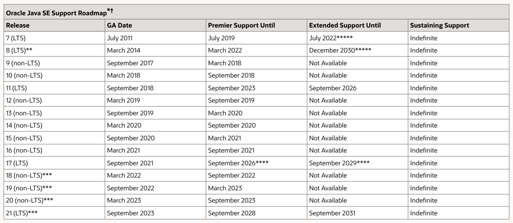

= 概述
ifndef::rootdir[:rootdir: ..]
ifndef::imagesdir[:imagesdir: {rootdir}/img]

在2022年Spring6和Spring-Boot3发布，其最低依赖jdk版本: JDK17，跳过了JDK8到16的版本。如果我们考虑这个情景，可能有几个原因支持这一举措：

* 新功能和增强功能

Java的每个版本通常都引入新功能、性能改进和增强功能。通过定位JDK 17，使用Spring 6和Spring Boot 3的开发人员将能够利用最新的语言功能和优化。

* 长期支持

作为一个长期支持的版本，JDK 17将为Spring项目提供一个稳定的平台，确保它们在较长时间内获得更新和安全补丁。

* 社区采用

如果Java社区主要采用了JDK 17和随后的版本，Spring对齐到最新标准可以利用社区驱动的改进，并确保兼容性。

* 生态系统的演进

受到广泛技术生态系统的变化的影响，包括工具、框架和部署环境的改进，这些都更好地与较新的JDK版本相匹配。

* 较旧版本的生命周期结束

Java有一个可预测的发布周期，较旧的版本最终会到达其生命周期的终点。通过跳过JDK版本8到16，Spring可能鼓励用户摆脱过时且不受支持的Java版本。

- JDK9新特性
- JDK10新特性
- JDK11新特性
- JDK12新特性
- JDK13新特性
- JDK14新特性
- JDK15新特性
- JDK16新特性
- JDK17新特性

